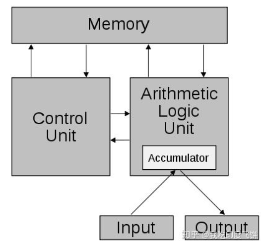
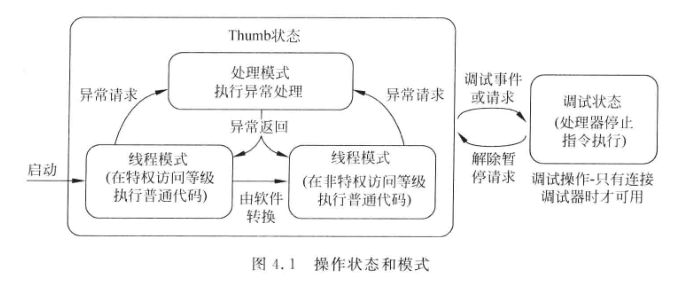

# ARM CortexM3&M4权威指南

## 计算机基础

#### 冯-诺依曼结构和哈佛结构

##### 冯诺伊曼结构

​	冯-诺依曼结构又被称为普林斯顿体系结构。该结构的处理器使用同一个存储器，经由同一个总线传输。冯诺依曼结构处理器有以下几个特点：

1. 必须有一个存储器
2. 必须有一个控制器
3. 必须有一个运算器，用于完成算术运算和逻辑运算
4. 必须有输入和输出设备，用于人机交互

##### 哈佛结构

​	哈佛结构将程序指令存储和数据存储分开的存储器结构。中央处理器首先到程序指令存储器中读取程序指令内容，解码后得到数据地址，再到相应的数据存储器中读取数据并进行下一步操作(通常为执行)。程序指令存储和数据存储分开，**可以使得指令和数据有不同的数据宽度**。

​	哈佛结构执行效率高，其程序指令和数据指令分开组织和存储，执行时可以预先读取下一条指令。哈佛的程序和数据空间相互独立，能够减轻程序运行时的访存瓶颈。

​	哈佛结构能基本解决取指和取数冲突的问题。

​	和冯-诺依曼结构结构相比，哈佛处理器有两个明显特点：

1. 使用两个独立的存储器模块，分别存储指令和数据，每个存储模块都不允许指令和数据并存
2. 使用两个独立的总线，分别作为CPU与每个存储器之间的专用通信路径。两条总线之间毫无关联

**改进型哈佛结构特点**：

	1. 使用两个独立的存储器模块，每个存储器模块都不允许指令和数据共存
	1. 具有一条独立的地址总线和一条独立的数据总线，利用**公用地址总线访问两个存储模块**(程序存储模块和数据存储模块)，**公共数据总线则被用来完成程序存储模块或数据存储模块与CPU之间的数据传输**
	1. 两条总线由程序存储器和数据存储器分时复用

## 架构

### 编程模型

#### 1. 操作模式和操作状态

针对ARM Cortex M3/M4处理器，处理器具有两个操作模式，两个状态以及两个访问等级。

1. 访问等级

   + 特权访问等级：可以访问处理器中的所有资源。
   + 非特权访问等级：某些存储区域不可以访问，也叫“用户”状态

2. 操作状态

   + 调试状态：处理器被暂停后,会进入调试状态，调试器停止运行。该状态仅用于调试操作，通过调试器发起调试请求或处理器中的调试不见产生的调试事件进入。该模式可以修改处理器寄存器数值。
   + Thumb状态：程序在执行程序代码时处于Thumb状态。

   操作状态用于区分处理器是正在正常执行代码还是在被调试器调试。

3. 操作模式

   + 处理模式：执行中断异常程序(ISR)等异常处理时处于处理模式。该模式总是处于特权访问等级。
   + 线程模式：执行普通程序代码。该模式可以处于特权访问等级也可处于非特权访问等级，具体由**CONTROL寄存器**控制。处理器可以从特权线程模式切换到非特权线程模式，但是不可以从非特权线程模式切换到特权线程模式，必须借助异常机制才可以。

   操作状态用于区分处理器是执行中断还是执行普通的程序代码。

Cortex M处理器在启动后默认处于特权线程模式，且使用MSP指针

#### 2. 寄存器

​	加载-存储架构：针对ARM架构，若处理的是存储器中的数据，则需要将其从存储器加载到寄存器组中的寄存器中。若处理器处理完后，若有必要还会写回寄存器中。

​	Cortex-M3和Cortex-M4处理器的寄存器组中有16个寄存器，13个为32位通用寄存器(R0-R12)，其他三个为R13栈指针(SP)寄存器,R14,链接寄存器(LR),以及R15程序寄存器(PC).

