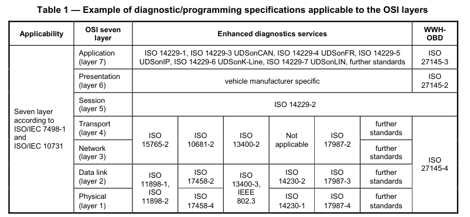

# ISO14229-1

# UDS(Unified diagnostic services统一诊断服务)

# Part-1规范与要求

## 1. 简介

ISO 14229 的制定是为了定义诊断系统的通用要求，无论采用何种串行数据链路。

ISO14229基于OSI七层模型为参考而制定，按照该模型进行映射时，诊断测试仪和ECU所使用的服务依据下表被划分到以下各层。

+ 应用层(第7层)：统一诊断服务规定于 ISO 14229-1、ISO 14229-3 UDSonCAN、ISO 14229-4 UDSonFR、ISO 14229-5 UDSonIP、ISO 14229-6 UDSonK-Line、ISO 14229-7 UDSonLIN、其他相关标准以及 ISO 27145-3 WWH-OBD。
+ 表示层(第6层):由车辆制造商规定，以及 ISO 27145-2 WWH-OBD。
+ 会话层服务(第5层):规定于ISO14229-2.
+ 传输层服务(第4层):规定于 ISO 15765-2 DoCAN、ISO 10681-2 FlexRay 通信、ISO 13400-2 DoIP、ISO 17987-2 LIN、ISO 27145-4 WWH-OBD。
+ 网络层服务(第3层):规定于 ISO 15765-2 DoCAN、ISO 10681-2 FlexRay 通信、ISO 13400-2 DoIP、ISO 17987-2 LIN、ISO 27145-4 WWH-OBD。
+ 数据链路层服务(第2层):规定于 ISO 11898-1、ISO 11898-2、ISO 17458-2、ISO 13400-3、IEEE 802.3、ISO 14230-2、ISO 17987-3 LIN 及其他相关标准、ISO 27145-4 WWH-OBD。
+ 物理层(第1层)：规定于 ISO 11898-1、ISO 11898-2、ISO 17458-4、ISO 13400-3、IEEE 802.3、ISO 14230-1、ISO 17987-4 LIN 及其他相关标准、ISO 27145-4 WWH-OBD。

## 2. Scope(范围)

​	ISO 14229 的本部分规定了诊断服务中与数据链路无关的要求，这些服务允许诊断测试仪（客户端）控制车载电子控制单元（ECU，服务器）中的诊断功能，例如连接至嵌入道路车辆中的串行数据链路的电子燃油喷射、自动变速箱、防抱死制动系统等。

​	它规定了通用服务，这些服务允许诊断测试仪（客户端）停止或恢复数据链路上的非诊断消息传输。

​	ISO 14229 的本部分不适用于两个电子控制单元（ECU）之间在车辆通信数据链路上的非诊断消息传输。然而，ISO 14229 的本部分不限制在 ECU 中实现车内车载测试仪（客户端），以便利用车辆通信数据链路上的诊断服务来执行双向诊断数据交换。

​	ISO 14229 的本部分不规定任何实现要求。

## 3.术语、定义、符号和缩略语

| 名称                        | 含义                                                         |
| --------------------------- | ------------------------------------------------------------ |
| boot software               | 在服务器的一个特殊部分中执行，主要用于启动并执行服务器编程的软件。 |
| client                      | 客户端：诊断仪的一部分，使用诊断服务的功能。测试仪(Tester)通常还会有其他功能,如数据库管理等。通常为诊断服务的发起者 |
| server                      | 接受请求，提供诊断服务并响应的一方                           |
| diagnostic data             | 存储于电子控制单元存储器中，并可由测试仪检查和/或可能修改的数据。 |
| diagnostic routine          | 嵌入在电子控制单元中、并且可由服务器在客户端请求时启动的例程。 |
| diagnostic service          | 由client发起的信息交换，目的是从server请求诊断信息，和/或为诊断目的修改server的行为 |
| diagnostic session          | 诊断会话：服务器内的一种状态，该状态下，特定的一组诊断服务和功能被启用 |
| diagnostic trouble code DTC | 车载诊断系统识别出的故障状况的数字通用标识符。               |
| ECU                         | 电子控制单元，包含至少一个服务                               |
| functional unit             | 一组功能相近或互补的诊断服务                                 |
| integer type                | 一种简单类型，其可区分的值为正整数和负整数，包括零。         |
| local client                | 连接到与服务端相同的本地网络，并且与服务端处于同一地址空间的客户端 |
| local server                | 连接到与客户端相同的本地网络，并且与客户端处于同一地址空间的服务端。 |
| OSI                         | 开放系统互连                                                 |
| permanent DTC               | 永久性诊断故障码:诊断故障码（DTC），即使在收到清除 DTC 请求之后，仍保留在非易失性存储器中，直到满足其他准则（通常是法规性准则）为止（例如，每个 DTC 的相应监视器已成功通过）。 |
| record                      | 一个或多个诊断数据元素，它们通过单一标识方式被一起引用。包含各种输入/输出数据和故障码的快照是记录的一个示例。 |
| remote server               | 远程服务器：不直接连接到主诊断网络的服务端                   |
| remote client               | 不直接连接到主诊断网络的客户端                               |
| reprogramming software      | 引导软件中允许对电子控制单元进行重新编程的部分。             |
| security                    | 用于保护车辆模块免遭通过车辆诊断数据链路进行的“未经授权”入侵的机制。 |
| server                      | 服务器：属于电子控制单元一部分、并提供诊断服务的功能。       |
| supported DTC               | 当前已配置/标定并使能，以在预定义车辆条件下执行的诊断故障码。 |
| tester                      | 测试仪：一种系统，它控制诸如对车载电子控制单元进行测试、检查、监测或诊断等功能，并且可能专用于某一特定类型的操作人员（例如，专供汽车修理厂技工使用的非车载扫描工具、专供装配厂使用的非车载测试工具，或车载测试仪）。 |

